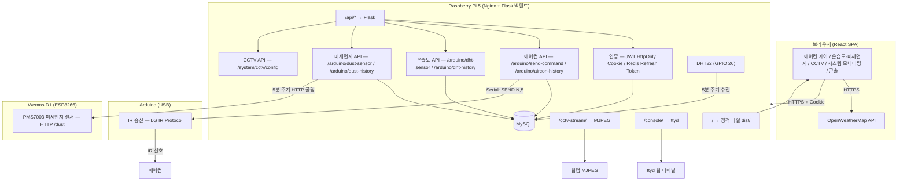

# 개요

라즈베리파이 5에서 운영 중인 개인 스마트홈 대시보드.

아두이노로 에어컨 IR 제어, DHT22로 온습도 수집,

Wemos D1 + PMS7003으로 미세먼지 수집,

CCTV 스트리밍을 웹에서 통합 관리한다.

---

# 시스템 구성

| 구성 요소 | 역할 |
| --- | --- |
| 라즈베리파이 5 | 서버 호스팅 (백엔드 + 프론트 빌드 서빙), Nginx 리버스 프록시, CCTV·ttyd 프록시, DHT22 센서 데이터 수집 |
| 아두이노 (USB 시리얼) | 에어컨 IR 신호 발신 (`/dev/ttyUSB0`) |
| Wemos D1 (ESP8266) + PMS7003 | WiFi 미세먼지 센서 모듈, 독립 HTTP 서버로 동작 |
| MySQL | 온습도 기록, 미세먼지 기록, 에어컨 제어 기록, 사용자 저장 |
| Redis | Refresh Token 저장 (7일 TTL, 사용 시마다 로테이션) |

---

# 기술 스택

**백엔드**

- Python 3, Flask
- MySQL, Redis
- Adafruit_DHT — DHT22 GPIO 직접 읽기
- requests — Wemos D1 HTTP 폴링 (5분 정각마다 미세먼지 수집)
- pyserial — 아두이노 시리얼 통신
- bcrypt / PyJWT — 비밀번호 해싱 및 JWT 인증
- systemd 서비스로 운영

**프론트엔드**

- React + Vite
- MUI (Material UI), @mui/x-charts, @mui/x-date-pickers
- TanStack Query (React Query)
- Axios (`withCredentials: true`로 쿠키 자동 전송)
- dayjs
- OpenWeatherMap API (외부 날씨)

**아두이노**

- IRremote 라이브러리
- LG IR 프로토콜 (`irsend.sendLG`)
- 시리얼 통신으로 라즈베리파이와 연결

---

# 기능 목록

| 기능 | 설명 |
| --- | --- |
| 홈 대시보드 | 실시간 시계 + 외부 날씨, 실내 환경 요약, 에어컨 빠른 제어, 오늘 온습도·미세먼지 추이 차트 |
| 에어컨 제어 | 냉방/제습, 온도(18~30도), 바람 세기(약/중/강/자동) IR 제어 |
| 단축 명령 | 전원 ON/OFF, 파워냉방 원클릭 |
| 실시간 온습도·미세먼지 | DHT22(온습도), PMS7003(PM1.0·PM2.5·PM10) 5초마다 자동 갱신 |
| 온습도·미세먼지 기록 | 5분 정각마다 DB 저장, dht-history 조회 후 타임스탬프 범위로 dust-history 순차 조회 후 5분 버킷으로 병합 표시, 날짜/시간으로 특정 기록으로 바로 이동 |
| 에어컨 제어 기록 | 전송 명령어 및 아두이노 응답 이력, 날짜/시간으로 특정 기록으로 바로 이동 |
| CCTV | Nginx로 프록시한 MJPEG 실시간 스트리밍, 해상도 드롭다운으로 실시간 변경 (mjpg_streamer 재시작 + 스트림 자동 재연결) |
| 시스템 모니터링 | CPU/RAM/Storage(NVMe)/Network 실시간 현황 (3초마다 갱신) |
| 시스템 콘솔 | ttyd 기반 웹 터미널 |
| 회원 관리 | 로그인, 회원가입, 비밀번호 변경, 회원 탈퇴 |
| 다크모드 | 라이트/다크/시스템 설정 3가지 모드, localStorage에 저장 |

---

# 시스템 아키텍처 흐름도



---

# 아두이노 명령어 코드 체계

라즈베리파이 → 아두이노 시리얼 통신 프로토콜: `SEND <index>,<repeats>`

| 인덱스 범위 | 내용 |
| --- | --- |
| 0 | 전원 OFF |
| 1 | 전원 ON + 냉방 기본값 |
| 2 | 파워냉방 |
| 3 ~ 54 | 냉방 (바람 4단계 × 온도 13단계) |
| 55 ~ 106 | 제습 (바람 4단계 × 온도 13단계) |

- `repeats=5` 고정 — LG IR 수신 안정성 확보 목적
- 프론트 `commandUtils.js`의 `commandDescriptions[]`와 인덱스 1:1 매핑

---

# 인증 흐름

```
로그인 요청
→ 백엔드: access_token(30분) + refresh_token(7일, Redis 저장)을 HttpOnly 쿠키로 발급
→ 브라우저: 이후 모든 요청에 쿠키 자동 첨부 (withCredentials: true)
→ access_token 만료(401) 시: 인터셉터가 /auth/refresh 자동 호출 + 토큰 로테이션
→ refresh_token도 만료 시: 로그아웃 처리 후 로그인 페이지로 이동
```

신규 가입 계정은 `is_active = FALSE`로 생성되며, 관리자가 DB에서 직접 활성화해야 로그인 가능.

---

# 향후 검토 사항

- **HTTPS 배포 시:** 쿠키에 `Secure` 속성 추가 권장
- **로컬 LLM 챗봇:** Ollama + Gemma 3 1B / Qwen 2.5 1.5B + ChromaDB 조합으로 자연어 에어컨 제어, 온도 조회 등 추가 가능
